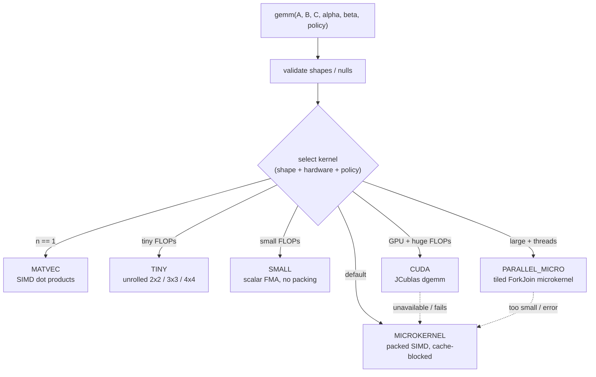

# LambdaCompute (JLC)

A dense linear-algebra library written in Java, built around a from-scratch,
SIMD-aware GEMM (general matrix multiply) engine with a policy-driven dispatch
layer, an optional CUDA path, off-heap storage, and a numerical-diagnostics web
application on top.

Live site: https://lambdacompute.org/

> **Reading this as a reviewer?** Jump to [What's interesting here](#whats-interesting-here),
> the [GEMM architecture](#gemm-architecture), the [correctness story](#correctness-story),
> and the [Reviewer guide](#reviewer-guide). The fastest way to verify the core
> claims is the two commands in [Verify it yourself](#verify-it-yourself).

---

## What's interesting here

This repo is presented as a systems / performance engineering case study. The
interesting parts are not the web app - they are the matrix-multiply core and
the discipline used to keep it correct while making it fast:

- A hand-written GEMM kernel using the Java Vector API (`jdk.incubator.vector`).
  Packed A/B panels, a register-blocked microkernel with FMA, K-unrolling, and
  masked remainder handling follow the same broad structure as BLIS/GotoBLAS,
  but in Java.
- A dispatch layer (`DispatchPolicy`, `GemmDispatch`) that selects a kernel
  (tiny / small / matvec / single-thread microkernel / parallel / CUDA) from
  problem shape and hardware, with cache-aware block sizing.
- Two GEMM surfaces with different trade-offs: `BLAS3Kernels` (packed SIMD plus
  strided / transposed / column-major variants and a parallel path) and
  `OptimizedBLAS3` (the optimized dispatch-driven path used for the main CPU
  route).
- An optional CUDA path through JCublas (`CudaGemm`) that is used only when a
  GPU is genuinely available and falls back cleanly otherwise.
- Off-heap matrices (`OffHeapMatrix`) supported on the GEMM paths.
- An independent, test-only correctness oracle (`GemmReference`) and a set of
  parity tests that pin every public GEMM surface to it.
- A parity-gated benchmark harness that refuses to time any backend that fails
  correctness, and reports median-based GFLOPs with full distribution stats.
- A real bug found and fixed through these tests: a wide-SIMD `4x4`
  microkernel correctness failure (see [Correctness story](#correctness-story)).

---

## What was hard

A few problems in this codebase were genuinely non-trivial:

- Making a Java Vector-API GEMM both fast and correct across vector widths.
  `DoubleVector.SPECIES_PREFERRED` is 2 lanes on some machines, 4 on AVX2, 8 on
  AVX-512. Kernels that hard-code a width are silently wrong on a wider
  machine. The bug fixed in this branch was exactly this class of error: a
  `4x4` kernel that loaded and stored full-width vectors when the preferred
  width was `> 4`, reading and writing neighboring memory. The fix masks the
  4-column loads and stores. See
  [SpecializedKernels.gemm4x4](src/main/java/net/faulj/compute/SpecializedKernels.java).
- Trusting benchmark numbers. A microbenchmark that times an incorrect kernel
  is worse than useless. The harness here computes an independent oracle result
  first and gates timing on parity - a backend that disagrees with the oracle is
  reported `valid=false` with no GFLOPs at all.
- Comparing backends honestly. Headline speedups use the median, never best of
  N; small problems are repeated internally to clear timer granularity; and the
  naive baseline and independent oracle are size-capped so they do not dominate
  wall-clock at large sizes. Methodology lives in
  [BENCHMARKS.md](BENCHMARKS.md).

---

## GEMM architecture

The two CPU GEMM surfaces share the same building blocks (packing + a SIMD
microkernel) but differ in how they dispatch.



### Components

| Area | Class | Role |
| --- | --- | --- |
| Dispatch policy | [`DispatchPolicy`](src/main/java/net/faulj/compute/DispatchPolicy.java) | Thresholds, parallelism, SIMD/CUDA enable flags |
| Kernel selection + blocking | [`GemmDispatch`](src/main/java/net/faulj/compute/GemmDispatch.java) | Picks kernel; computes cache-aware MC/KC/NC/MR/NR |
| Packed SIMD kernels | [`BLAS3Kernels`](src/main/java/net/faulj/compute/BLAS3Kernels.java) | `gemm`, `gemmStrided`, `gemmStridedTransA`, `gemmStridedColMajorA/B`, parallel path |
| Optimized dispatch path | [`OptimizedBLAS3`](src/main/java/net/faulj/compute/OptimizedBLAS3.java) | Main CPU route; `gemm`, `gemmStrided` |
| Microkernel | [`MicroKernel`](src/main/java/net/faulj/compute/MicroKernel.java) | Register-blocked FMA inner loop |
| Specialized kernels | [`SpecializedKernels`](src/main/java/net/faulj/compute/SpecializedKernels.java) | matvec, tiny 2x2/3x3/4x4, outer product |
| Optional GPU | [`CudaGemm`](src/main/java/net/faulj/compute/CudaGemm.java) | JCublas `dgemm`, only when CUDA is usable |

### How the kernels work

- Packing. B is packed into SIMD-width panels (`packB`); A is packed into
  `MR`-row strips (`packA`), with `alpha` folded in during the pack. Strided,
  transposed, and column-major source layouts have their own pack routines so
  the microkernel always sees a contiguous panel.
- Microkernel. The inner loop holds up to `MR` rows of C in vector registers,
  broadcasts A scalars, and issues fused multiply-adds against packed B rows,
  K-unrolled. The column remainder is handled with a `VectorMask`.
- Blocking. Block sizes (`MC/KC/NC`) are derived from rough L1/L2/L3 estimates
  following the BLIS layering, so the working set of each loop level targets a
  cache level.

---

## Correctness story

Performance work on numeric kernels is only credible if correctness is pinned
independently. This repo does that with a test-only oracle and parity tests.

- Independent oracle:
  [`GemmReference`](src/test/java/net/faulj/compute/GemmReference.java) is a
  deliberately simple triple-loop GEMM, plus strided / transposed /
  column-major reference variants, used only in tests.
- Parity tests pin every public GEMM surface to the oracle across a grid of
  shapes and `alpha` / `beta` values, including degenerate dimensions and
  null / dimension-mismatch error paths:
  - [`GemmParityTest`](src/test/java/net/faulj/compute/GemmParityTest.java):
    `BLAS3Kernels.gemm`, `OptimizedBLAS3.gemm`, the Matrix-returning facade,
    zero / degenerate dimensions, and the wide-SIMD `4x4` regression case.
  - [`GemmStridedParityTest`](src/test/java/net/faulj/compute/GemmStridedParityTest.java):
    `gemmStrided`, `gemmStridedTransA`, `gemmStridedColMajorA`,
    `gemmStridedColMajorB`, and `OptimizedBLAS3.gemmStrided`.
  - [`GemmOffHeapParityTest`](src/test/java/net/faulj/compute/GemmOffHeapParityTest.java):
    the off-heap (`OffHeapMatrix`) GEMM path, including post-compute sync.
  - [`GemmNumericEdgeTest`](src/test/java/net/faulj/compute/GemmNumericEdgeTest.java):
    documents the current behavior of each CPU path for `beta=0` on NaN-seeded
    C, `alpha=0`, and `0 x infinity`, rather than asserting an idealized one.
  - [`GemmCudaParityTest`](src/test/java/net/faulj/compute/GemmCudaParityTest.java)
    (optional) and
    [`GemmLargeParityTest`](src/test/java/net/faulj/compute/GemmLargeParityTest.java)
    (slow, opt-in) cover the CUDA path and large shapes.

### The bug this branch's tests caught

`OptimizedBLAS3.gemm` failed parity on a tiny `4x4x4` problem only on machines
where `DoubleVector.SPECIES_PREFERRED.length() > 4` (for example AVX-512, 8
lanes).

- Root cause: `SpecializedKernels.gemm4x4` issued full-width vector loads and
  stores for 4-column rows. On an 8-lane machine each "row" load pulled in 4
  extra doubles from the next row, and the store wrote them back, corrupting
  the result and touching out-of-row memory.
- Fix: mask the 4-column B/C loads and stores with `SPECIES.indexInRange(0, 4)`
  whenever the preferred width exceeds 4, so the kernel stays within its
  logical 4 columns regardless of hardware vector width.
- Outcome: what had been an ignored known-failure case is now an active,
  passing parity test (`optimizedBlas3WideSimdTiny4x4MatchesReference`).

---

## Benchmark methodology

A parity-gated backend comparison harness lives in test sources so it can use
the independent oracle and package-private CUDA helpers without changing
production code:
[`GemmBackendComparison`](src/test/java/net/faulj/compute/GemmBackendComparison.java).

Key properties, with full detail in [BENCHMARKS.md](BENCHMARKS.md):

- Every backend is parity-checked before it is timed; a failing backend is
  emitted with `valid=false` and no GFLOPs / speedup.
- Reports median, mean, sample stddev, min, p10/p25/p75/p90, plus
  median-based GFLOPs and speedup.
- Records machine metadata (CPU, JVM, vector lanes, CUDA status, git commit,
  seed) into the artifacts.
- Writes CSV + JSON under `build/reports/gemm/`.
- Has a quick mode (`-Dgemm.quick=true`) and a PowerShell-safe invocation.

Backend labels (`blas3-naive`, `blas3-simd-1t`, `blas3-parallel`, `opt-1t`,
`opt-parallel`, `cuda`) and the property table are documented in
[BENCHMARKS.md](BENCHMARKS.md). Numbers are intentionally not reproduced here
because they are host-specific.

---

## Verify it yourself

GEMM parity + edge tests:

```powershell
.\gradlew.bat --% test --no-daemon --rerun-tasks --tests net.faulj.compute.Gemm*
```

Quick parity-gated benchmark run:

```powershell
.\gradlew.bat --% runGemmBackendComparison -Dgemm.quick=true --no-daemon
```

Artifacts land in `build/reports/gemm/`. See [BENCHMARKS.md](BENCHMARKS.md) for
backend labels, properties, and methodology. On Linux/macOS use `./gradlew`
and drop the `--%` token.

Optional / opt-in suites:

```powershell
# CUDA parity (requires a working CUDA + JCublas runtime)
.\gradlew.bat --% gemmCudaTest --no-daemon

# Slow large-shape parity
.\gradlew.bat --% gemmSlowTest -Dfaulj.gemm.slow=true --no-daemon
```

---

## Known limitations

Stated plainly, because a case study that hides these is not credible:

- Benchmark numbers are machine-specific. They depend on CPU, vector width,
  JVM, thermal state, and JIT. Do not treat one host's numbers as portable.
- CUDA may be slower on small matrices. `CudaGemm.gemm` timing includes
  host/device allocation, transfer, and launch overhead, so small problems can
  lose to the CPU path even when CUDA is available.
- `BLAS3Kernels` parallel path is scalar-parallel, not SIMD-parallel. The
  `blas3-parallel` backend is ForkJoin plus blocked scalar work, not the packed
  SIMD microkernel.
- The independent oracle is size-capped (`gemm.independentOracleMaxSize`,
  default 512). Above that, the harness falls back to using `opt-1t` as a
  reference backend (`oracle_type=backend_reference`), which is weaker than an
  independent oracle.
- This README does not claim a clean full-repo `test` run. The verified surface
  for this case study is the targeted GEMM suite above plus the quick benchmark
  harness. A local `.\gradlew.bat --% test --no-daemon` attempt during this
  final pass was inconclusive because Gradle hit test-output file-lock and
  long-run issues before I could establish a trustworthy repo-wide result.
- Some loose `*.out` / `*.log` files at the repo root are historical analysis
  dumps, not the current source of truth. The current generated root-level
  performance artifacts are also untracked and outside this README-only change.

### Deliberately not claimed

This README does not claim:

- JNI / C++ native GEMM
- a hand-written C++ AVX kernel
- direct `ByteBuffer` GEMM
- strided batched GEMM
- column-major-C GEMM output
- universal CUDA acceleration
- cross-machine benchmark portability

---

## Reviewer guide

If you have ten minutes, read these in order:

| # | File | Why |
| --- | --- | --- |
| 1 | [`GemmReference.java`](src/test/java/net/faulj/compute/GemmReference.java) | The independent correctness oracle |
| 2 | [`GemmParityTest.java`](src/test/java/net/faulj/compute/GemmParityTest.java) | Parity grid + the `4x4` regression test |
| 3 | [`GemmStridedParityTest.java`](src/test/java/net/faulj/compute/GemmStridedParityTest.java) | Strided / transposed / column-major parity |
| 4 | [`SpecializedKernels.java`](src/main/java/net/faulj/compute/SpecializedKernels.java) | The fixed `gemm4x4` wide-SIMD masking |
| 5 | [`OptimizedBLAS3.java`](src/main/java/net/faulj/compute/OptimizedBLAS3.java) + [`GemmDispatch.java`](src/main/java/net/faulj/compute/GemmDispatch.java) | Dispatch + cache-aware blocking |
| 6 | [`BLAS3Kernels.java`](src/main/java/net/faulj/compute/BLAS3Kernels.java) | Packed SIMD microkernel + strided variants |
| 7 | [`GemmBackendComparison.java`](src/test/java/net/faulj/compute/GemmBackendComparison.java) + [`BENCHMARKS.md`](BENCHMARKS.md) | Parity-gated harness + methodology |
| 8 | [`build.gradle`](build.gradle) | Vector API / preview flags, test wiring, `runGemmBackendComparison` task |

---

## The wider project

The GEMM core sits inside a numerical-diagnostics web app, which serves as a
working demo vehicle:

- `src/main/java/net/faulj`: core library (matrix/vector types, decompositions,
  solvers, eigen / spectral routines, condition / accuracy metrics, benchmark
  helpers)
- `src/main/java/net/faulj/web`: Spring Boot API (`/api/diagnostics`,
  `/api/status`, benchmark / status streams)
- `frontend`: React + Vite client for matrix input, decomposition and spectral
  views, history / favorites, and settings

### Requirements

- Java 21 (project toolchain; uses preview features + `jdk.incubator.vector`)
- Node.js 18+
- npm 9+

### Run locally

```powershell
# backend (http://localhost:8080)
.\gradlew.bat --% bootRun

# frontend (http://localhost:5173), in a second terminal
cd frontend
npm install
npm run dev
```

The Vite dev server proxies `/api` to `http://localhost:8080`
via `frontend/vite.config.js`.

### Build

```powershell
.\gradlew.bat --% build

cd frontend
npm run build
```

### Deployment notes

- Contact-form delivery uses a backend-only `DISCORD_WEBHOOK_URL`. Never place
  webhook secrets in `VITE_*` variables.
- In production set `APP_SECURITY_HEAVY_ENDPOINT_TOKEN` (backend) and
  `VITE_HEAVY_ENDPOINT_TOKEN` (frontend) for heavy API routes.
- The debug Schur endpoint is disabled by default
  (`app.debug.endpoints.enabled=false`).
- Large matrices are intentionally capped for synchronous full diagnostics.

## License

See [LICENSE](LICENSE).
