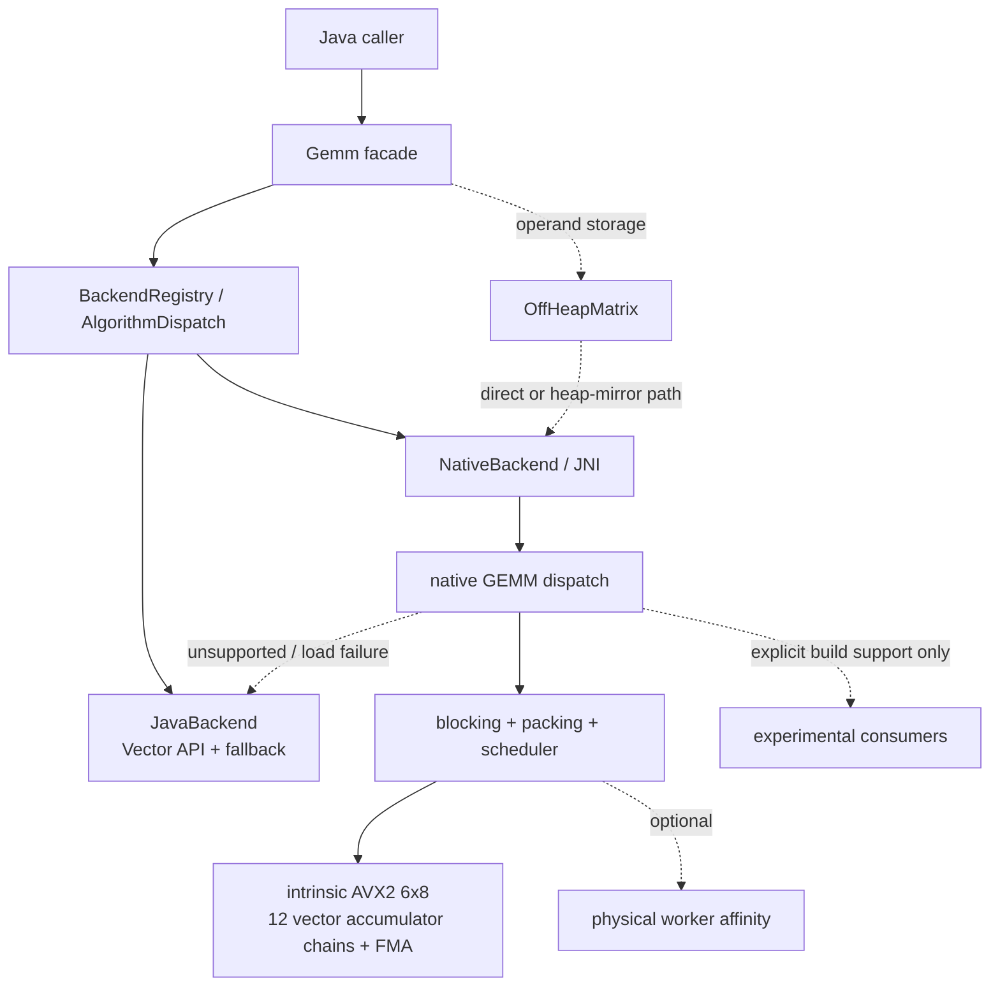

# LambdaCompute (JLC)

LambdaCompute is a Java/C++ dense linear-algebra library and
numerical-diagnostics application, centered on a correctness-gated native FP64
GEMM backend with a portable Java Vector API fallback.

Live site: <https://lambdacompute.org/>

## Performance headline

Controlled benchmark: a same-host comparison for dense FP64 GEMM:

| Host | Workload | JLC native | Same-host reference | Ratio | Controlled setup |
| --- | --- | ---: | ---: | ---: | --- |
| AMD Ryzen 9 3950X, 16 physical Zen 2 cores / 32 logical CPUs | `C = A × B`, `2048³` | **~521 GFLOP/s median** | AOCL-BLIS: **583.348 GFLOP/s** | **89.3%** | 16 physical workers; physical worker affinity enabled for the benchmark |

The controlled median was 520.959 GFLOP/s, or 89.3% of that reference. Healthy
validated runs have been in the ~520–530 GFLOP/s range. This is a host-specific,
median-based measurement, not a claim of universal BLAS parity or portability.
The library default keeps worker affinity disabled; the controlled benchmark
explicitly enabled `JLC_NATIVE_WORKER_AFFINITY=physical`.

## Why this project is interesting

JLC is useful as a systems and performance-engineering case study because it
connects several layers that are easy to benchmark incorrectly in isolation:

- a public Java GEMM facade and backend policy;
- a JNI boundary with direct, heap-mirror, strided, transposed, and off-heap
  cases;
- a from-scratch native blocked GEMM with packing, a register-blocked AVX2
  microkernel, and a persistent worker pool;
- correctness tests that cover the native contract before performance claims;
- empirical optimization gates that keep attractive but regressive experiments
  out of the production path.

The Spring Boot and React application makes the numerical library inspectable,
but the main engineering story is the matrix-multiply core and the evidence
around it.

## Architecture


```mermaid
flowchart TD
    Caller["Java caller"] --> Facade["Gemm facade"]
    Facade --> Registry["BackendRegistry / AlgorithmDispatch"]
    Registry --> Java["JavaBackend\nVector API + fallback"]
    Registry --> Native["NativeBackend / JNI"]
    Facade -. "operand storage" .-> OffHeap["OffHeapMatrix"]
    OffHeap -. "direct or heap-mirror path" .-> Native
    Native --> Dispatch["native GEMM dispatch"]
    Dispatch --> Work["blocking + packing + scheduler"]
    Work --> Kernel["intrinsic AVX2 6x8\n12 vector accumulator chains + FMA"]
    Work -. "optional" .-> Affinity["physical worker affinity"]
    Dispatch -. "unsupported / load failure" .-> Java
    Dispatch -. "explicit build support only" .-> Experimental["experimental consumers"]
```

The Java entry point is [`Gemm`](src/main/java/net/faulj/kernels/gemm/Gemm.java).
`BackendRegistry` probes the native library and
[`AlgorithmDispatch`](src/main/java/net/faulj/nativeblas/AlgorithmDispatch.java)
selects a backend for the requested algorithm and shape. A missing library,
unsupported layout, failed native call, or unsupported operation can return to
the Java implementation instead of turning an optional native backend into a
hard application dependency.

| Layer | Current role |
| --- | --- |
| GEMM API | [`Gemm.java`](src/main/java/net/faulj/kernels/gemm/Gemm.java) exposes matrix, strided, transposed, column-major, and batched entry points. |
| Backend policy | [`BackendRegistry.java`](src/main/java/net/faulj/nativeblas/BackendRegistry.java) and [`AlgorithmDispatch.java`](src/main/java/net/faulj/nativeblas/AlgorithmDispatch.java) coordinate availability and algorithm selection. |
| Native bridge | [`NativeBackend.java`](src/main/java/net/faulj/nativeblas/NativeBackend.java) owns library loading, native calls, direct/off-heap handling, and Java fallback. |
| Java backend | [`JavaBackend.java`](src/main/java/net/faulj/nativeblas/JavaBackend.java) routes to the in-process Java kernels. |
| Native implementation | [`gemm.cpp`](native-backend/src/main/cpp/kernels/gemm.cpp) resolves work, runs the worker pool, and exposes the C/JNI-facing GEMM implementation. |
| Native kernel structure | [`gemm_internal.hpp`](native-backend/src/main/cpp/kernels/gemm_internal.hpp), [`gemm_panel.hpp`](native-backend/src/main/cpp/kernels/gemm_panel.hpp), and [`gemm_compute.hpp`](native-backend/src/main/cpp/kernels/gemm_compute.hpp) separate planning, panel work, and microkernels. |
| Off-heap storage | [`OffHeapMatrix.java`](src/main/java/net/faulj/matrix/OffHeapMatrix.java) supports Java foreign-memory storage and native-compatible layouts. |

Runtime selection is controlled by `jlc.backend=auto|java|native` (default
`auto`). Per-algorithm overrides use
`jlc.algorithm.<name>.backend=auto|java|cpp`; an explicit native request still
falls back to Java if the library cannot load or the operation is unsupported.

## Matrix compiler pathway

JLC also has an opt-in matrix-expression compiler. A `MatrixExpr` DAG is
planned, lowered to bounded affine/dependence facts, checked with legal M3
schedule transformations, and can now execute through a small CPU lowering
layer. Matrix multiplication remains on the existing optimized `Gemm` facade;
the compiler adds inspectable matrix-chain optimization and explicit
elementwise/transpose execution without presenting JLC as a general-purpose
polyhedral compiler. See [`docs/MATRIX_COMPILER.md`](docs/MATRIX_COMPILER.md).

## Native GEMM design

The production path computes `C = alpha * A * B + beta * C` through a layered
GEMM structure rather than sending the whole operation to one monolithic loop.

### Blocking and packing

- The validated `2048³` configuration uses `MC/KC/NC = 2048/256/128` and
  `MR/NR = 6/8`.
- A is packed as row-separated strips and B as regular panels. The main path
  uses worker-private A packing, so each worker can consume its own scratch
  without a shared-A synchronization cost.
- The planner resolves cache-oriented block sizes and supports explicit tuning
  overrides for controlled experiments. The current defaults are documented in
  [`docs/EXPERIMENTAL_GEMM_PATHS.md`](docs/EXPERIMENTAL_GEMM_PATHS.md).

### Microkernel

On the validated AVX2 path, the interior tile is an intrinsic 6x8 kernel. It
keeps six rows by two four-double vectors of C in registers, for twelve vector
accumulator chains, and advances the K loop with AVX2 fused multiply-adds. The
production implementation is in
[`gemm_compute.hpp`](native-backend/src/main/cpp/kernels/gemm_compute.hpp).

### Scheduling, tails, and fallbacks

The native backend uses a persistent worker pool and a panel scheduler. A
single resolved runtime configuration supplies scheduler and affinity choices
to the worker task, so hot loops do not repeatedly parse environment variables.
The ordinary panel scheduler is the default. Tail panels, partial M/N/K tiles,
non-AVX2 builds, unsupported layouts, and other edge cases use the corresponding
generic or scalar path. Worker startup or task failures are handled through the
native error path and can fall back at the Java boundary.

Physical-core affinity is deliberately opt-in with
`JLC_NATIVE_WORKER_AFFINITY=physical`. It is useful for controlled topology
experiments and for the benchmark above, but the portable library default is
`none`. The `shared-tail` scheduler is retained as an optional correctness-
validated behavior for shapes where it helps; it is not the default contract.

## Optimization story: what was hard

The final kernel is the result of rejecting several plausible ideas when their
evidence did not generalize to the target workload:

- The production AVX2 path moved from the older 5x4 kernel to the intrinsic
  6x8 kernel, which retained the best repeatable throughput and code shape.
- U2 lost about 8.25% at the target size. U4 and the no-inline variant remain
  useful for code-generation comparisons but did not clear the promotion gate.
- Handwritten k-major6 assembly was kept behind explicit experimental build
  support. Its isolated low-thread result was not enough to justify its
  high-thread behavior as the production default.
- K-major A layouts, NR8 B packing/prefetch, and shared-A/L3 packing were
  retained for reproduction or diagnosis after regressing at the important
  multi-worker points. The current layout keeps the regular panel/private-A
  path simple and measurable.
- Blocking searches did not produce a repeatable promotion above the current
  `2048/256/128` configuration. The exact block controls therefore remain
  tuning inputs, not promises about a universally optimal tile geometry.

The lesson is not that every experiment failed; it is that a fast isolated
sample is insufficient evidence for a default numerical kernel. The complete
classification is in the
[experimental-path manifest](docs/EXPERIMENTAL_GEMM_PATHS.md).

## Correctness and validation

The native backend is correctness-gated before benchmarking:

| Boundary | Validated milestone |
| --- | --- |
| Default native build | Pass |
| Native CTest contract suite | 2/2 pass |
| Targeted Java/native integration suite | 14/14 pass across backend, heap, off-heap, and strided tests |
| Full Gradle test suite | Pass |
| Experimental selector behavior | Unsupported selectors rejected by the default build |
| Production code generation | Known-good 6x8 structure retained; no hot-loop calls or vector spills in the audited path |

The targeted integration tests are
[`BackendRegistryTest`](src/test/java/net/faulj/nativeblas/BackendRegistryTest.java),
[`NativeGemmIntegrationTest`](src/test/java/net/faulj/nativeblas/NativeGemmIntegrationTest.java),
[`NativeOffHeapGemmIntegrationTest`](src/test/java/net/faulj/nativeblas/NativeOffHeapGemmIntegrationTest.java),
and
[`NativeStridedGemmIntegrationTest`](src/test/java/net/faulj/nativeblas/NativeStridedGemmIntegrationTest.java).

Earlier validation also covered padded and strided operands, transposed inputs,
tails, alpha/beta behavior, scheduler and persistent-worker behavior, fallback
workers, concurrency, fault/rollback handling, and affinity/topology
diagnostics. Those cases are why the README describes the native path as
correctness-gated rather than as a benchmark-only kernel.

## Benchmark methodology

The public number follows a deliberately narrow protocol:

- FP64 square GEMM at `2048³` on one AMD Ryzen 9 3950X host;
- two warmups and five timed calls, with the median used for the headline;
- the built-in native provider using the intrinsic 6x8 path, panel scheduling,
  private A packing, and `MC/KC/NC = 2048/256/128`;
- physical workers selected explicitly for the controlled multi-thread run;
- a same-host AOCL-BLIS comparison measured under the corresponding controlled
  physical-core setup;
- correctness and code-generation checks completed before retaining the
  performance claim.

The result is intentionally stated as approximately `520–530 GFLOP/s` and
approximately `89%` of the controlled reference. It is not the best single
sample, not a cross-machine guarantee, and not a claim that JLC is faster than
BLAS. See [`docs/PERFORMANCE_SUMMARY.md`](docs/PERFORMANCE_SUMMARY.md) for the
public measurement summary.

## Production vs experimental paths

| Classification | Current contents |
| --- | --- |
| **Production** | Intrinsic AVX2 6x8; row-separated A; regular panel B; worker-private A packing; panel scheduler; persistent and per-call fallback worker paths; scalar/generic correctness fallbacks. |
| **Successful optional** | `JLC_NATIVE_WORKER_AFFINITY=physical`; `JLC_NATIVE_GEMM_SCHEDULER=shared-tail` where its shape and worker balance justify it. |
| **Experimental, rejected, or historical** | U2/U4/no-inline variants; handwritten k-major6 assembly; k-major6 A layout; NR8 B layout and prefetch; shared-A/L3 packing; exact block overrides; small-K update experiments; legacy kernel selectors. |

The normal CMake build has
`JLC_NATIVE_ENABLE_EXPERIMENTAL_GEMM=OFF` and
`JLC_NATIVE_ENABLE_EXPERIMENTAL_ASM=OFF`. Experimental assembly is not part of
normal execution. If a selector such as `6x8-u2`, `6x8-u4`, `6x8-u4-asm`, or
`6x8-noinline` is requested without experimental GEMM support, the configuration
rejects it; it does not silently select the intrinsic production path. The
assembly consumers require an explicit
`-DJLC_NATIVE_ENABLE_EXPERIMENTAL_ASM=ON` build. See the full
[native GEMM path manifest](docs/EXPERIMENTAL_GEMM_PATHS.md).

## Build, run, and verify

### Requirements

- Java 21 JDK and the Gradle wrapper;
- CMake 3.20 or newer and a C++17 compiler for the JNI backend;
- x86-64 AVX2/FMA for the validated optimized production path;
- optional BLAS/LAPACK development libraries. CMake can use a detected vendor
  provider, or the built-in implementation can be forced with
  `JLC_NATIVE_VENDOR_BLAS=NONE`;
- Node.js and npm only when running the React frontend.

The native CMake project requires a JDK path because it includes `jni.h`.
Gradle selects Java 21 for native configuration and test execution.

### Java and native build

From the repository root on Linux or macOS:

```bash
./gradlew build
./gradlew buildNativeBackend
```

To build the native backend while forcing the built-in provider:

```bash
./gradlew -Djlc.native.vendor.blas=NONE buildNativeBackend
```

The corresponding native CMake targets are also available directly:

```bash
cmake -S native-backend -B build/native-backend-tests \
  -DJLC_JAVA_HOME="$JAVA_HOME" \
  -DCMAKE_BUILD_TYPE=Release \
  -DJLC_NATIVE_VENDOR_BLAS=NONE \
  -DJLC_NATIVE_BUILD_TESTS=ON \
  -DJLC_NATIVE_ENABLE_TEST_HOOKS=ON
cmake --build build/native-backend-tests --config Release
ctest --test-dir build/native-backend-tests --output-on-failure
```

On Windows, use `gradlew.bat` or the equivalent CMake workflow. The MSVC
native path must compile with AVX2 enabled; the project configures `/arch:AVX2`
for that target.

### Verification and benchmark entry points

```bash
# Native JNI integration tests: backend selection, GEMM, off-heap, and strided paths
./gradlew testNativeBackend

# Regular Java correctness and unit suite
./gradlew test

# Standalone native C++ GEMM sweep (benchmark-oriented)
./gradlew runNativeCppGemmSweep
```

The native test task builds the shared library first and runs the four focused
Java integration classes listed in [Correctness and validation](#correctness-and-validation).
The full CTest command above is the direct native contract check. Benchmark
entry points are intentionally separate from the ordinary correctness suite.

### Run the web application

```bash
./gradlew bootRun
```

The Spring Boot backend listens on `http://localhost:8080` by default. To run
the frontend in a second terminal:

```bash
cd frontend
npm install
npm run dev
```

The frontend is a diagnostics surface; it is not part of the CPU GEMM
benchmark claim.

## Java fallback and the wider project

The Java path remains an important part of JLC. [`JavaBackend.java`](src/main/java/net/faulj/nativeblas/JavaBackend.java)
routes through [`OptimizedBLAS3.java`](src/main/java/net/faulj/compute/OptimizedBLAS3.java) and
[`BLAS3Kernels.java`](src/main/java/net/faulj/compute/BLAS3Kernels.java), which
use Java's Vector API and provide portable, testable alternatives when native
execution is unavailable or a shape/layout is outside the native contract. The
Java implementation is therefore a fallback and comparison path, not an
obsolete artifact and not the sole optimized GEMM engine.

The repository also contains:

- foreign-memory/off-heap matrix support through
  [`OffHeapMatrix.java`](src/main/java/net/faulj/matrix/OffHeapMatrix.java);
- an optional JCuda/JCublas path in
  [`CudaGemm.java`](src/main/java/net/faulj/compute/CudaGemm.java), guarded by
  [`CudaSupport.java`](src/main/java/net/faulj/compute/CudaSupport.java);
- decompositions, eigensolvers, and linear solvers under
  [`src/main/java/net/faulj/decomposition`](src/main/java/net/faulj/decomposition)
  and [`src/main/java/net/faulj/solve`](src/main/java/net/faulj/solve);
- the Spring Boot diagnostics API in
  [`Application.java`](src/main/java/net/faulj/web/Application.java).

CUDA is optional and was not used for the `2048³` CPU result above. The native
backend also contains hooks for other numerical routines, but this milestone's
validated performance story is the built-in CPU GEMM path.

## Known limitations

- The headline is specific to one Ryzen 9 3950X host, build, operating-system
  state, and thermal/run history. It should not be projected to other CPUs.
- The validated optimized path assumes AVX2/FMA. Other instruction sets and
  unsupported layouts use their compiled alternatives or the Java fallback;
  the headline does not cover those configurations.
- Native worker affinity defaults to none. Enabling physical affinity can
  improve repeatability on a controlled machine but is not a portable default.
- Optional CUDA and vendor BLAS/LAPACK support are real project capabilities,
  but neither is included in the CPU GEMM headline.
- Experimental selectors are for reproduction, diagnostics, and future work;
  they are not production recommendations.
- The ratio is against a measured same-host AOCL-BLIS reference. It is not a
  generic percentage of “BLAS” and does not promise superiority.

## Reviewer guide

For a focused review, read the current architecture in this order:

1. [`Gemm.java`](src/main/java/net/faulj/kernels/gemm/Gemm.java) — public GEMM
   facade and layout variants.
2. [`BackendRegistry.java`](src/main/java/net/faulj/nativeblas/BackendRegistry.java)
   and [`AlgorithmDispatch.java`](src/main/java/net/faulj/nativeblas/AlgorithmDispatch.java)
   — backend availability and algorithm selection.
3. [`NativeBackend.java`](src/main/java/net/faulj/nativeblas/NativeBackend.java)
   — JNI loading, direct/off-heap handling, and fallback behavior.
4. [`gemm.cpp`](native-backend/src/main/cpp/kernels/gemm.cpp) — native planning,
   worker pool, scheduling, and public native entry points.
5. [`gemm_internal.hpp`](native-backend/src/main/cpp/kernels/gemm_internal.hpp),
   [`gemm_panel.hpp`](native-backend/src/main/cpp/kernels/gemm_panel.hpp), and
   [`gemm_compute.hpp`](native-backend/src/main/cpp/kernels/gemm_compute.hpp) —
   resolved configuration, packing contract, and microkernel dispatch.
6. [`gemm_config.cpp`](native-backend/src/main/cpp/kernels/gemm_config.cpp) and
   [`native-backend/CMakeLists.txt`](native-backend/CMakeLists.txt) — defaults
   and experimental build gates.
7. [`NativeGemmIntegrationTest.java`](src/test/java/net/faulj/nativeblas/NativeGemmIntegrationTest.java),
   [`NativeOffHeapGemmIntegrationTest.java`](src/test/java/net/faulj/nativeblas/NativeOffHeapGemmIntegrationTest.java),
   and [`NativeStridedGemmIntegrationTest.java`](src/test/java/net/faulj/nativeblas/NativeStridedGemmIntegrationTest.java)
   — native correctness boundaries.
8. [`docs/EXPERIMENTAL_GEMM_PATHS.md`](docs/EXPERIMENTAL_GEMM_PATHS.md) and
   [`docs/PERFORMANCE_SUMMARY.md`](docs/PERFORMANCE_SUMMARY.md) — path
   classification and public measurement evidence.
9. [`build.gradle`](build.gradle) — Java 21, native configuration, test, and
   benchmark entry points.

## License

See [`LICENSE`](LICENSE).
